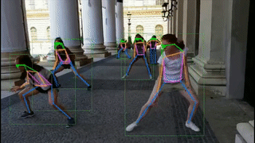

# Demo

This page provides tutorials about running demos. Please click the caption for more information.

 

     

[2D human pose demo](docs/2d_human_pose_demo.md)

 

 

[2D human whole-body pose demo](docs/2d_wholebody_pose_demo.md)

 

     

[2D hand pose demo](docs/2d_hand_demo.md)

 

     

[2D face keypoint demo](docs/2d_face_demo.md)

 

     

[2D pose tracking demo](docs/2d_pose_tracking_demo.md)

     

[2D animal_pose demo](docs/2d_animal_demo.md)

