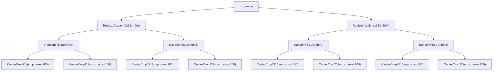

# Customize Data Transformation and Augmentation

## DATA TRANSFORM

In the OpenMMLab repositories, dataset construction and data preparation are decoupled from each other. Usually, the dataset construction only parses the dataset and records the basic information of each sample, while the data preparation is performed by a series of data transforms, such as data loading, preprocessing, and formatting based on the basic information of the samples.

### To use Data Transforms

In MMEngine, we use various callable data transforms classes to perform data manipulation. These data transformation classes can accept several configuration parameters for instantiation and then process the input data dictionary by calling. Also, all data transforms accept a dictionary as input and output the processed data as a dictionary. A simple example is as belows:

> In MMEngine, we don’t have the implementations of data transforms. you can find the base data transform class and many other data transforms in MMCV. So you need to install MMCV before learning this tutorial, see the [MMCV installation guide](https://mmcv.readthedocs.io/en/2.x/get_started/installation.html).

```python
import numpy as np
from mmcv.transforms import Resize
transform = Resize(scale=(224, 224))
data_dict = {'img': np.random.rand(256, 256, 3)}
data_dict = transform(data_dict)
print(data_dict['img'].shape)
```

```shell
(224, 224, 3)
```

### Implement a simple custom data transformation

To achieve custom data transformation, the following steps are usually required:

1. Define a data augmentation class and register it in the `TRANSFORMS` register of `mmcv`

2. Let the enhancement class inherit from `BaseTransform`

3. Implement the `transform` function and have it accept input of dictionary type and return output of dictionary type
   Taking the implementation of data augmentation as an example:

```Python
import random
import mmcv
from mmcv.transforms import BaseTransform, TRANSFORMS

@TRANSFORMS.register_ Module() # 1 register
class MyFlip (BaseTransform): # 2 Inherit BaseTransform
    def __init__ (self, direction: str):
        super().__init__ ()
        Self. direction=direction
    def transform (self, results: dict) ->dict: # Accept dictionary type input
        img=results ['img ']
        results ['img ']=mmcv. imflip (img, direction=self. direction) # Accept dictionary type output
    return results
```

At this point, a simple data augmentation has been completed

### Common data augmentation tools

The OpenMMLab series algorithm library has implemented many Transforms, and during the implementation process, we found that many data changes have commonalities. Therefore, a series of data augmentation tools are provided for these commonalities in MMCV, making it convenient for everyone to reuse code and quickly achieve custom data augmentation. These tools can not only improve the development efficiency of data augmentation, but also combine existing data augmentations to create new data augmentations. Therefore, when implementing new data augmentation, we need to consider whether it is necessary and whether the new requirements can be achieved by combining existing data augmentation.

###Compose

[Composite](https://mmcv.readthedocs.io/zh_CN/latest/api/generated/mmcv.transforms.Compose.html#mmcv.transforms.Compose) can concatenate one or more data enhancements into one data enhancement

```Python
pipeline = [
    dict(type='LoadImageFromFile', key='gt_img'),
    dict(type='Compose', transforms=[
        dict(type='RandomCrop', crop_size=(384, 384)),
        dict(type='Normalize'),
    ])
]
```

Although the effect of Compose and expanding data in the list is almost the same, when Compose and TTA are combined, there will be unexpected effects

### KeyMapper

Different data classes may use different field names for the same data when parsing datasets. For example, for detection box type data that collides with (N, 4), some datasets may resolve as `gt_bboxes`, some are `bboxes`. At this point, it will be found that the previously implemented data augmentation is no longer available, as implementing the transform will access the specified fields of the input `dict`, and an error will be reported when the fields do not match. So MMCV provided [KeyMapper](https://mmcv.readthedocs.io/zh_CN/latest/api/generated/mmcv.transforms.KeyMapper.html#mmcv.transforms.KeyMapper) to solve this problem.

The above configuration can achieve the integration of map the `gt_img` field to `img` and use the `img` field in `Crop` and `Normalize`, and finally map the `img` field back to `gt_img` output to `results`.

### TransformBroadcast

Sometimes we need to apply the same transformation to data from different fields, such as flipping images and annotations simultaneously, and normalizing high-resolution and low-resolution data. At this time, we can use [TransformBroadcaster](https://mmcv.readthedocs.io/zh_CN/latest/api/generated/mmcv.transforms.TransformBroadcaster.html#mmcv.transforms.TransformBroadcaster).

```python
pipeline = [
    dict(type='LoadImageFromFile', key='lq'),  # low-quality image
    dict(type='LoadImageFromFile', key='gt'),  # ground-truth image
    # Using TransformBroadcaster, map multiple external fields
    # ('lq 'and' gt ') to internal fields' img' in sequence,
    # and process them sequentially using wrapped transforms
    dict(type='TransformBroadcaster',
        mapping=dict(img=['lq', 'gt']),  # Scenario 1: From multiple fields
        # input_mapping=dict(img='images'),  # Scenario 2: From a field containing multiple data
        auto_remap=True,
        share_random_param=True,  # When processing multiple data fields, use the same set of random parameters
        transforms=[
           # Simply use the standard field 'img' in the Transform implementation
            dict(type='RandomCrop', crop_size=(384, 384)),
            dict(type='Normalize'),
        ])
]
```

It should be noted that data augmentation such as `RandomCrop` usually has a certain degree of randomness. To ensure that data augmentation for different fields uses the same random parameters, it is necessary to add `share_random_param` is set to `True`. Similarly, in order to ensure that the customized data augmentation strategy can be combined with `TransformBroadcaster` and can be used through `share_random_ param` controls randomness. We need to abstract the code containing randomness in data augmentation into a method and use [cache_randomness](https://github.com/open-mmlab/mmcv/blob/89a264527e3dc9c5eebed6195faa709d446c7a9c/mmcv/transforms/utils.py#L14) decorator:

```python
import numpy as np
from mmcv.transforms.utils import cache_randomness

@TRANSFORMS.register_module()  # 1. register
class MyFlip(BaseTransform):   # 2. inherit BaseTransform
    def __init__(self, direction: str):
        super().__init__()
        self.direction = direction

    @cache_randomness
    def _should_flip(self):
        return np.random.random() > 0.5

    def transform(self, results: dict) -> dict:  # Accept dictionary type input
        if self._should_flip():
            img = results['img']
            results['img'] = mmcv.imflip(img, direction=self.direction)  # Accept Dictionary Type Output
        return results
```

_To ensure that custom data augmentation can process data from different fields using the same random parameters in TransformBroadcast, two conditions need to be met:_

- Abstract code containing randomness into one or more methods

- Use `cache_randomness` decorator decorates one or more random methods

### RandomApply and RandomApply

In order to introduce stronger randomness for data augmentation, MMCV implemented:

- [RandomChoice](https://mmcv.readthedocs.io/zh_CN/latest/api/generated/mmcv.transforms.RandomChoice.html#mmcv.transforms.RandomChoice) used to randomly select one of multiple candidate sub pipelines for execution.

- [RandomApply](https://mmcv.readthedocs.io/zh_CN/latest/api/generated/mmcv.transforms.RandomApply.html?highlight=RandomApply) used to execute wrapped sub pipelines with a certain probability.

### Data augmentation during testing

TTA (Test time augmentation) is a data augmentation strategy during the testing phase, aimed at performing data augmentation such as flipping and scaling on the same image during the testing process. The predicted results of each enhanced image are restored to their original size and fused to obtain more accurate prediction results. If you have some very customized TTA processes, before re implementing TTA, it is advisable to first see if you can achieve the desired functionality based on the existing [TestTimeAug](https://mmcv.readthedocs.io/zh_CN/latest/api/generated/mmcv.transforms.TestTimeAug.html?highlight=TestTimeAug) through combination, such as the following configuration:

```python
dict(type='TestTimeAug',
     transforms=[
        [dict(type='Resize', scale=(1333, 400), keep_ratio=True),
         dict(type='Resize', scale=(1333, 800), keep_ratio=True)],
        [dict(type='RandomFlip', prob=1.),
         dict(type='RandomFlip', prob=0.)],
        [[dict(type='CenterCrop', crop_size=100), dict(type='RandomRotate', crop_size=100)],
        [dict(type='PackDetInputs',
              meta_keys=('img_id', 'img_path', 'ori_shape',
                         'img_shape', 'scale_factor', 'flip',
                         'flip_direction'))]])
```

You can enhance the same image 8 times:



Users can achieve exponential level data augmentation by stacking different augmentation strategies.

### To use in Config Files

In config files, we can compose multiple data transforms as a list, called a data pipeline. And the data pipeline is an argument of the dataset.

Usually, a data pipeline consists of the following parts:

1. Data loading, use [LoadImageFromFile](https://mmcv.readthedocs.io/en/2.x/api/generated/mmcv.transforms.LoadImageFromFile.html#mmcv.transforms.LoadImageFromFile) to load image files.

2. Label loading, use [LoadAnnotations](https://mmcv.readthedocs.io/en/2.x/api/generated/mmcv.transforms.LoadAnnotations.html#mmcv.transforms.LoadAnnotations) to load the bboxes, semantic segmentation and keypoint annotations.

3. Data processing and augmentation, like [RandomResize](https://mmcv.readthedocs.io/en/2.x/api/generated/mmcv.transforms.RandomResize.html#mmcv.transforms.RandomResize).

4. Data formatting, we use different data transforms for different tasks. And the data transform for specified task is implemented in the corresponding repository. For example, the data formatting transform for image classification task is `PackClsInputs` and it’s in MMPretrain.

Here, taking the classification task as an example, we show a typical data pipeline in the figure below. For each sample, the basic information stored in the dataset is a dictionary as shown on the far left side of the figure, after which, every blue block represents a data transform, and in every data transform, we add some new fields (marked in green) or update some existing fields (marked in orange) in the data dictionary.


If want to use the above data pipeline in our config file, use the below settings:

```python
test_dataloader = dict(
    batch_size=32,
    dataset=dict(
        type='ImageNet',
        data_root='data/imagenet',
        pipeline = [
            dict(type='LoadImageFromFile'),
            dict(type='Resize', size=256, keep_ratio=True),
            dict(type='CenterCrop', crop_size=224),
            dict(type='PackClsInputs'),
        ]
    )
)
```

### Common Data Transforms

According to the functionality, the data transform classes can be divided into data loading, data pre-processing & augmentation and data formatting.

#### Data Loading

To support loading large-scale dataset, usually we won’t load all dense data during dataset construction, but only load the file path of these data. Therefore, we need to load these data in the data pipeline.

| Data Transforms                                                                                                     | Functionality                                                                         |
| ------------------------------------------------------------------------------------------------------------------- | ------------------------------------------------------------------------------------- |
| [LoadImageFromFile](https://mmcv.readthedocs.io/en/2.x/api/generated/mmcv.transforms.LoadImageFromFile.html#mmcv.transforms.LoadImageFromFile) | Load images according to the path.                                                    |
| [LoadAnnotations](https://mmcv.readthedocs.io/en/2.x/api/generated/mmcv.transforms.LoadImageFromFile.html#mmcv.transforms.LoadImageFromFile) | Load and format annotations information, including bbox, segmentation map and others. |

#### Data Pre-processing & Augmentation

Data transforms for pre-processing and augmentation usually manipulate the image and annotation data, like cropping, padding, resizing and others.

| Data Transforms                                                                                                                            | Functionality                                                  |
| ------------------------------------------------------------------------------------------------------------------------------------------ | -------------------------------------------------------------- |
| [Pad](https://mmcv.readthedocs.io/en/2.x/api/generated/mmcv.transforms.Pad.html#mmcv.transforms.Pad)                                       | Pad the margin of images.                                      |
| [CenterCrop](https://mmcv.readthedocs.io/en/2.x/api/generated/mmcv.transforms.CenterCrop.html#mmcv.transforms.CenterCrop)                  | Crop the image and keep the center part.                       |
| [Normalize](https://mmcv.readthedocs.io/en/2.x/api/generated/mmcv.transforms.Normalize.html#mmcv.transforms.Normalize)                     | Normalize the image pixels.                                    |
| [Resize](https://mmcv.readthedocs.io/en/2.x/api/generated/mmcv.transforms.Resize.html#mmcv.transforms.Resize)                              | Resize images to the specified scale or ratio.                 |
| [RandomResize](https://mmcv.readthedocs.io/en/2.x/api/generated/mmcv.transforms.RandomResize.html#mmcv.transforms.RandomResize)            | Resize images to a random scale in the specified range.        |
| [RandomChoiceResize](https://mmcv.readthedocs.io/en/2.x/api/generated/mmcv.transforms.RandomChoiceResize.html#mmcv.transforms.RandomChoiceResize) | Resize images to a random scale from several specified scales. |
| [RandomGrayscale](https://mmcv.readthedocs.io/en/2.x/api/generated/mmcv.transforms.RandomGrayscale.html#mmcv.transforms.RandomGrayscale)   | Randomly grayscale images.                                     |
| [RandomFlip](https://mmcv.readthedocs.io/en/2.x/api/generated/mmcv.transforms.RandomFlip.html#mmcv.transforms.RandomFlip)                  | Randomly flip images.                                          |

#### Data Formatting

Data formatting transforms will convert the data to some specified type.

| Data Transforms                                                                                                            | Functionality                                                                  |
| -------------------------------------------------------------------------------------------------------------------------- | ------------------------------------------------------------------------------ |
| [ToTensor](https://mmcv.readthedocs.io/en/2.x/api/generated/mmcv.transforms.ToTensor.html#mmcv.transforms.ToTensor)        | Convert the data of specified field to <font color=#1188cb>torch.Tensor</font> |
| [ImageToTensor](https://mmcv.readthedocs.io/en/2.x/api/generated/mmcv.transforms.ImageToTensor.html#mmcv.transforms.ImageToTensor) | Convert images to <font color=#1188cb>torch.Tensor</font> in PyTorch format.   |

#### Custom Data Transform Classes

To implement a new data transform class, the class needs to inherit `BaseTransform` and implement `transform` method. Here, we use a simple flip transforms (`MyFlip`) as example:

```python
import random
import mmcv
from mmcv.transforms import BaseTransform, TRANSFORMS

@TRANSFORMS.register_module()
class MyFlip(BaseTransform):
    def __init__(self, direction: str):
        super().__init__()
        self.direction = direction

    def transform(self, results: dict) -> dict:
        img = results['img']
        results['img'] = mmcv.imflip(img, direction=self.direction)
        return results
```

Then, we can instantiate a `MyFlip` object and use it to process our data dictionary.

```python
import numpy as np

transform = MyFlip(direction='horizontal')
data_dict = {'img': np.random.rand(224, 224, 3)}
data_dict = transform(data_dict)
processed_img = data_dict['img']
```

Or, use it in the data pipeline by modifying our config file:

```python
pipeline = [
    ...
    dict(type='MyFlip', direction='horizontal'),
    ...
]
```

Please note that to use the class in our config file, we need to confirm the `MyFlip` class will be imported during running.
