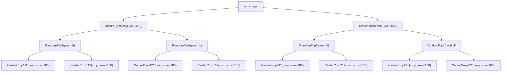

# 自定义数据转换和增强

## 数据变换 (DATA TRANSFORM)

在 OpenMMLab 算法库中，数据集的构建和数据的准备是相互解耦的。通常，数据集的构建只对数据集进行解析，记录每个样本的基本信息；而数据的准备则是通过一系列的数据变换，根据样本的基本信息进行数据加载、预处理、格式化等操作。

### 使用数据变换类

在 MMEngine 中，我们使用各种可调用的数据变换类来进行数据的操作。这些数据变换类可以接受若干配置参数进行实例化，之后通过调用的方式对输入的数据字典进行处理。同时，我们约定所有数据变换都接受一个字典作为输入，并将处理后的数据输出为一个字典。一个简单的例子如下：

> MMEngine 中仅约定了数据变换类的规范，常用的数据变换类实现及基类都在 MMCV 中，因此在本篇教程需要提前安装好 MMCV，参见 [MMCV 安装教程](https://mmcv.readthedocs.io/zh_CN/2.x/get_started/installation.html)。

```python
import numpy as np
from mmcv.transforms import Resize
transform = Resize(scale=(224, 224))
data_dict = {'img': np.random.rand(256, 256, 3)}
data_dict = transform(data_dict)
print(data_dict['img'].shape)
```

```shell
(224, 224, 3)
```

### 实现一个简单的自定义数据变换

要实现自定义的数据变换，通常需要以下步骤：

1. 定义一个数据增强类，并将其注册到 `mmcv` 的 `TRANSFORMS` 注册器中

2. 让增强类继承自 `BaseTransform`

3. 实现 `transform` 函数，并让其接受字典类型的输入，返回字典类型的输出

以实现翻数据增强为例:

```python
import random
import mmcv
from mmcv.transforms import BaseTransform, TRANSFORMS

@TRANSFORMS.register_module()  # 1. 注册
class MyFlip(BaseTransform):   # 2. 继承 BaseTransform
    def __init__(self, direction: str):
        super().__init__()
        self.direction = direction

    def transform(self, results: dict) -> dict:  # 接受字典类型输入
        img = results['img']
        results['img'] = mmcv.imflip(img, direction=self.direction)  # 接受字典类型输出
        return results
```

至此，一个简单的数据增强就已经完成了

### 常用的数据增强工具

OpenMMLab 系列算法库实现了非常多的 Transforms，在实现过程中我们发现很多数据变化都存在共性，因此针对这些共性 MMCV 提供了一系列的数据增强工具，方便大家复用代码，快速实现自定义的数据增强。这些工具不仅可以提高数据数据增强的开发效率，也能够通过组合的方式，基于现有的数据增强组合出一些新的数据增强。因此在实现新的数据增强时，我们需要考虑是否有必要，新的需求能否通过组合已有的数据增强来实现。

### Compose

[Compose](https://mmcv.readthedocs.io/zh_CN/latest/api/generated/mmcv.transforms.Compose.html#mmcv.transforms.Compose) 可以将一个或多个数据增强串联成一个数据增强

```python
pipeline = [
    dict(type='LoadImageFromFile', key='gt_img'),
    dict(type='Compose', transforms=[
        dict(type='RandomCrop', crop_size=(384, 384)),
        dict(type='Normalize'),
    ])
]
```

尽管Compose 和在列表中扩展数据增强的效果近乎相同，但是当 Compose 和 TTA 组合时，会有意想不到的效果

### KeyMapper

不同的数据类在解析数据集时可能会对同样的数据使用不同的字段名，例如对于相撞为 （N, 4）的检测框类型数据，有的数据集解析出来是 `gt_bboxes`，有的是 `bboxes`。这个时候会发现先前实现的数据增强不能用了，因为实现 transform 时会访问输入 `dict` 的指定字段，字段不匹配时候会报错。于是 MMCV 提供了 [KeyMapper](https://mmcv.readthedocs.io/zh_CN/latest/api/generated/mmcv.transforms.KeyMapper.html#mmcv.transforms.KeyMapper) 来解决这个问题。

上面这段配置就能实现将 `gt_img` 字段映射到 `img`，并且在 `Crop` 和 `Normalize` 时使用 `img` 字段，并最后将 `img` 字段映射回 `gt_img` 输出到 `results` 中。

### TransformBroadcaster

有些时候我们需要对不同字段的数据施加相同的变换，例如对图像和标注同时进行翻转，高分辨率、低分辨率的数据进行归一化，这个时候就可以使用 [TransformBroadcaster](https://mmcv.readthedocs.io/zh_CN/latest/api/generated/mmcv.transforms.TransformBroadcaster.html#mmcv.transforms.TransformBroadcaster)。

```python
pipeline = [
    dict(type='LoadImageFromFile', key='lq'),  # low-quality image
    dict(type='LoadImageFromFile', key='gt'),  # ground-truth image
    # 使用 TransformBroadcaster，将多个外部字段 ('lq' 和 'gt'）依次映射到内部字段
    # 'img'，并用 wrapped transforms 依次处理
    dict(type='TransformBroadcaster',
        mapping=dict(img=['lq', 'gt']),  # 情况 1： 来自多个字段
        # input_mapping=dict(img='images'),  #情况 2： 来自一个包含多个数据的字段
        auto_remap=True,
        share_random_param=True,  # 在处理多个数据字段时，使用一组相同的随机参数
        transforms=[
           # Transform 实现中使用标准字段 'img' 即可
            dict(type='RandomCrop', crop_size=(384, 384)),
            dict(type='Normalize'),
        ])
]
```

需要注意的是，像 `RandomCrop` 之类的数据增强通常存在一定的随机性，为了保证不同字段的数据增强使用相同的随机参数，需要将 `share_random_param` 设置为 `True`。同样的，为了保证自定义的数据增强策略能够被 `TransformBroadcaster` 组合使用，并能够通过 `share_random_param` 控制随机性。我们需要将数据增强中包含随机性的代码抽象到一个方法中，并对其使用 [cache_randomness](https://github.com/open-mmlab/mmcv/blob/89a264527e3dc9c5eebed6195faa709d446c7a9c/mmcv/transforms/utils.py#L14) 装饰器：

```python
import numpy as np
from mmcv.transforms.utils import cache_randomness

@TRANSFORMS.register_module()  # 1. 注册
class MyFlip(BaseTransform):   # 2. 继承 BaseTransform
    def __init__(self, direction: str):
        super().__init__()
        self.direction = direction

    @cache_randomness
    def _should_flip(self):
        return np.random.random() > 0.5

    def transform(self, results: dict) -> dict:  # 接受字典类型输入
        if self._should_flip():
            img = results['img']
            results['img'] = mmcv.imflip(img, direction=self.direction)  # 接受字典类型输出
        return results
```

_要保证自定义数据增强在 TransformBroadcaster 中，能够使用相同的随机参数处理不同字段的数据，需要满足两个条件：_

- 将含有随机性的代码抽象到一个或多个方法中
- 使用 `cache_randomness` 装饰器装饰一个或多个随机方法

### RandomApply 和 RandomApply

为了为数据增强引入更强的随机性，MMCV 实现了：

- [RandomChoice](https://mmcv.readthedocs.io/zh_CN/latest/api/generated/mmcv.transforms.RandomChoice.html#mmcv.transforms.RandomChoice)，用于在多个候选 sub-pipeline 中随机选择一个来执行。
- [RandomApply](https://mmcv.readthedocs.io/zh_CN/latest/api/generated/mmcv.transforms.RandomApply.html?highlight=RandomApply) 用于按照一定概率执行被包裹的 sub-pipeline。

```python
# 使用 RandomApply 在 2 个 sub-pipeline 中随机选择
pipeline = [
    ...
    dict(type='RandomChoice',
        transforms=[
            [dict(type='RandomHorizontalFlip')],  # sub-pipeline 1
            [dict(type='RandomRotate')],  # sub-pipeline 2
        ]
    ),
    ...
]

# 使用 RandomApply 随机执行一个 sub-pipeline
pipeline = [
    ...
    dict(type='RandomApply',
        transforms=dict(type='RandomHorizontalFlip'),
        prob=0.3),
    ...
]
```

### 测试时数据增强

TTA（Test time augmentation） 是一种测试阶段的数据增强策略，旨在测试过程中，对同一张图片做翻转、缩放之类的数据增强，将增强后每张图片预测的结果还原到原始尺寸后做融合，以获得更加准确的预测结果。如果你有一些非常定制化的 TTA 流程，在重新实现 TTA 之前，不妨先看看能否通过组合的方式，基于现有的 [TestTimeAug](https://mmcv.readthedocs.io/zh_CN/latest/api/generated/mmcv.transforms.TestTimeAug.html?highlight=TestTimeAug) 实现你想要的功能，例如这样的配置:

```python
dict(type='TestTimeAug',
     transforms=[
        [dict(type='Resize', scale=(1333, 400), keep_ratio=True),
         dict(type='Resize', scale=(1333, 800), keep_ratio=True)],
        [dict(type='RandomFlip', prob=1.),
         dict(type='RandomFlip', prob=0.)],
        [[dict(type='CenterCrop', crop_size=100), dict(type='RandomRotate', crop_size=100)],
        [dict(type='PackDetInputs',
              meta_keys=('img_id', 'img_path', 'ori_shape',
                         'img_shape', 'scale_factor', 'flip',
                         'flip_direction'))]])
```

可以对同一张图片进行 8 次增强：



用户可通过堆叠不同的增强策略以实现指数级别的数据增强

### 在配置文件中使用

在配置文件中，我们将一系列数据变换组合成为一个列表，称为数据流水线（Data Pipeline），传给数据集的 pipeline 参数。通常数据流水线由以下几个部分组成：

1. 数据加载，通常使用 [LoadImageFromFile](https://mmcv.readthedocs.io/zh_CN/2.x/api/generated/mmcv.transforms.LoadImageFromFile.html#mmcv.transforms.LoadImageFromFile)

2. 标签加载，通常使用 [LoadAnnotations](https://mmcv.readthedocs.io/zh_CN/2.x/api/generated/mmcv.transforms.LoadAnnotations.html#mmcv.transforms.LoadAnnotations)

3. 数据处理及增强，例如 [RandomResize](https://mmcv.readthedocs.io/zh_CN/2.x/api/generated/mmcv.transforms.RandomResize.html#mmcv.transforms.RandomResize)

4. 数据格式化，根据任务不同，在各个仓库使用自己的变换操作，通常名为 `PackXXXInputs`，其中 XXX 是任务的名称，如分类任务中的 `PackClsInputs`。

以分类任务为例，我们在下图展示了一个典型的数据流水线。对每个样本，数据集中保存的基本信息是一个如图中最左侧所示的字典，之后每经过一个由蓝色块代表的数据变换操作，数据字典中都会加入新的字段（标记为绿色）或更新现有的字段（标记为橙色）。


如果我们希望在测试中使用上述数据流水线，则配置文件如下所示：

```python
test_dataloader = dict(
    batch_size=32,
    dataset=dict(
        type='ImageNet',
        data_root='data/imagenet',
        pipeline = [
            dict(type='LoadImageFromFile'),
            dict(type='Resize', size=256, keep_ratio=True),
            dict(type='CenterCrop', crop_size=224),
            dict(type='PackClsInputs'),
        ]
    )
)
```

### 常用的数据变换类

按照功能，常用的数据变换类可以大致分为数据加载、数据预处理与增强、数据格式化。我们在 MMCV 中提供了一系列常用的数据变换类：

#### 数据加载

为了支持大规模数据集的加载，通常在数据集初始化时不加载数据，只加载相应的路径。因此需要在数据流水线中进行具体数据的加载。

| 数据变换类                                                                                                                                        | 功能                                      |
| ------------------------------------------------------------------------------------------------------------------------------------------------- | ----------------------------------------- |
| [LoadImageFromFile](https://mmcv.readthedocs.io/zh_CN/2.x/api/generated/mmcv.transforms.LoadImageFromFile.html#mmcv.transforms.LoadImageFromFile) | 根据路径加载图像                          |
| [LoadAnnotations](https://mmcv.readthedocs.io/zh_CN/2.x/api/generated/mmcv.transforms.LoadAnnotations.html#mmcv.transforms.LoadAnnotations)       | 加载和组织标注信息，如 bbox、语义分割图等 |

#### 数据预处理及增强

数据预处理和增强通常是对图像本身进行变换，如裁剪、填充、缩放等。

| 数据变换类                                                                                                                                           | 功能                               |
| ---------------------------------------------------------------------------------------------------------------------------------------------------- | ---------------------------------- |
| [Pad](https://mmcv.readthedocs.io/zh_CN/2.x/api/generated/mmcv.transforms.Pad.html#mmcv.transforms.Pad)                                              | 填充图像边缘                       |
| [CenterCrop](https://mmcv.readthedocs.io/zh_CN/2.x/api/generated/mmcv.transforms.CenterCrop.html#mmcv.transforms.CenterCrop)                         | 居中裁剪                           |
| [Normalize](https://mmcv.readthedocs.io/zh_CN/2.x/api/generated/mmcv.transforms.Normalize.html#mmcv.transforms.Normalize)                            | 对图像进行归一化                   |
| [Resize](https://mmcv.readthedocs.io/zh_CN/2.x/api/generated/mmcv.transforms.Resize.html#mmcv.transforms.Resize)                                     | 按照指定尺寸或比例缩放图像         |
| [RandomResize](https://mmcv.readthedocs.io/zh_CN/2.x/api/generated/mmcv.transforms.RandomResize.html#mmcv.transforms.RandomResize)                   | 缩放图像至指定范围的随机尺寸       |
| [RandomChoiceResize](https://mmcv.readthedocs.io/zh_CN/2.x/api/generated/mmcv.transforms.RandomChoiceResize.html#mmcv.transforms.RandomChoiceResize) | 缩放图像至多个尺寸中的随机一个尺寸 |
| [RandomGrayscale](https://mmcv.readthedocs.io/zh_CN/2.x/api/generated/mmcv.transforms.RandomGrayscale.html#mmcv.transforms.RandomGrayscale)          | 随机灰度化                         |
| [RandomFlip](https://mmcv.readthedocs.io/zh_CN/2.x/api/generated/mmcv.transforms.RandomFlip.html#mmcv.transforms.RandomFlip)                         | 图像随机翻转                       |

#### 数据格式化

数据格式化操作通常是对数据进行的类型转换。

| 数据变换类                                                                                                                            | 功能                                                        |
| ------------------------------------------------------------------------------------------------------------------------------------- | ----------------------------------------------------------- |
| [ToTensor](https://mmcv.readthedocs.io/zh_CN/2.x/api/generated/mmcv.transforms.ToTensor.html#mmcv.transforms.ToTensor)                | 将指定的数据转换为 <font color=##1188dd>torch.Tensor</font> |
| [ImageToTensor](https://mmcv.readthedocs.io/zh_CN/2.x/api/generated/mmcv.transforms.ImageToTensor.html#mmcv.transforms.ImageToTensor) | 将图像转换为 <font color=#1188dd>torch.Tensor</font>        |

#### 自定义数据变换类

要实现一个新的数据变换类，需要继承 `BaseTransform`，并实现 `transform` 方法。这里，我们使用一个简单的翻转变换（`MyFlip`）作为示例：

```python
import random
import mmcv
from mmcv.transforms import BaseTransform, TRANSFORMS

@TRANSFORMS.register_module()
class MyFlip(BaseTransform):
    def __init__(self, direction: str):
        super().__init__()
        self.direction = direction

    def transform(self, results: dict) -> dict:
        img = results['img']
        results['img'] = mmcv.imflip(img, direction=self.direction)
        return results
```

从而，我们可以实例化一个 `MyFlip` 对象，并将之作为一个可调用对象，来处理我们的数据字典。

```python
import numpy as np

transform = MyFlip(direction='horizontal')
data_dict = {'img': np.random.rand(224, 224, 3)}
data_dict = transform(data_dict)
processed_img = data_dict['img']
```

又或者，在配置文件的 pipeline 中使用 `MyFlip` 变换

```python
pipeline = [
    ...
    dict(type='MyFlip', direction='horizontal'),
    ...
]
```

需要注意的是，如需在配置文件中使用，需要保证 MyFlip 类所在的文件在运行时能够被导入。
